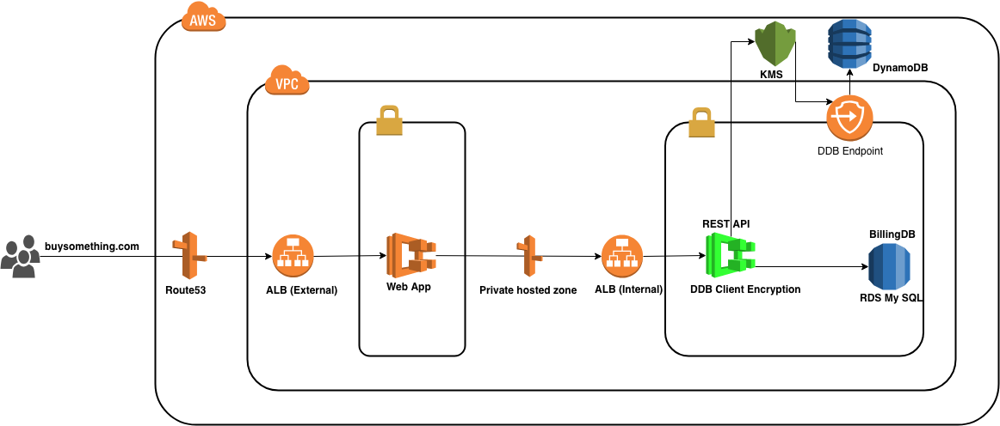
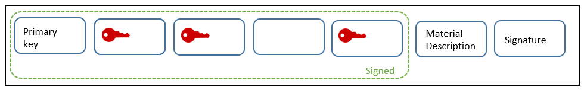
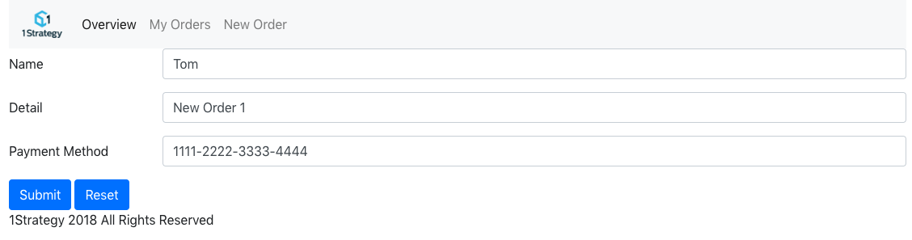
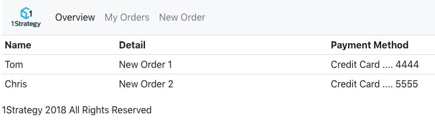

# How to protect Primary Account Number (PAN) data in AWS

## Overview
Customers frequently ask about how to securely store the credit card data in AWS which meets PCI compliance. They want end to end encryption of PAN data and security management of the encryption keys. This post provides a solution to secure PAN data using [Amazon DynamoDB Encryption Client](https://docs.aws.amazon.com/dynamodb-encryption-client/latest/devguide/what-is-ddb-encrypt.html) and [AWS Key Management Service (AWS KMS)](https://docs.aws.amazon.com/kms/latest/developerguide/overview.html). DynamoDB client-side encryption helps you to protect your data before you send it to DynamoDB, so your PAN data is encrypted in transit and at rest, and KMS makes it easy for you to create and manage encryption keys, and also tracks the usage of the encryption keys in AWS CloudTrail to meet your regulatory and compliance needs.

## System Design

Here is a typical three-tier billing system design to demonstrate how the tokenization solution works in an end to end scenario.



* DynamoDB - store encrypted PAN and its token.
* RDS MySQL DB -  store transaction data, no PAN related cypher stored in transaction DB here, only the PAN token with other billing information.
* KMS CMK - encryption provider, use Key Policy to secure the key access and also manage key rotation.
* ECS Fargate - host the web tier and data access tier applications.
* Route 53 - internal and external service discovery

## Encryption + Tokenization, layers of protection

1. With [DynamoDB client encryption library](https://docs.aws.amazon.com/dynamodb-encryption-client/latest/devguide/what-is-ddb-encrypt.html), each item is encrypted and signed on client side before sending to AWS, You can specify which attribute values to encrypt and which to include in the signature.
    * Encryption - protects the confidentiality of the attribute value (not the names)
    * Signing - protects the integrity of the data, detect unauthorized changes to the item as a whole

    

1. A random token (UUID) is generated for each PAN (Primary/Personal Account Number). The token is being used to represent the PAN in transaction DB and logs.

1. Plain text PAN only exists in memory on client, it'll never show up in any AWS services and logs.

1. Use KMS as Cryptographic Materials Provider.

1. You can use DynamoDB encryption at rest option (Server-Side Encryption) to add another layer of security.

## Deploy and test the solution locally

### Prerequisites

If you want to deploy and run the solution locally, be sure you have the following prerequisites.

1. Java 8 or later is installed

1. Apache Maven is installed, latest version if possible

1. Log in AWS Console:
    * Go to IAM > Encryption keys, click [Create key], follow the wizard to create a KMS CMK with proper key policy, and take a note of the arn of the key you created
    * Go to DynamoDB > click [Create table], and take a note of the table name and primary key attribute name
    * Go to RDS, create an MySQL db instance.

1. Create a table in the RDS MySQL DB you created in previous step with following SQL statement:

    ```SQL
    CREATE TABLE OrderHistory (
        UserPaymentAccountID INT NOT NULL AUTO_INCREMENT,
        OrderName TINYTEXT,
        Description TINYTEXT,
        AWS_PA_Token TINYTEXT,
        PRIMARY KEY (UserPaymentAccountID)
    );
    ```

1. Set your credentials by either of below approaches:

    * Add access_key and secret_access_key info into AWS credentials profile file on your local system (~/.aws/credentials):

        ```ini
        [default]
        aws_access_key_id = your_access_key_id
        aws_secret_access_key = your_secret_access_key
        ```
    * Set the AWS_ACCESS_KEY_ID and AWS_SECRET_ACCESS_KEY environment variables.

        ```bash
        export AWS_ACCESS_KEY_ID=your_access_key_id
        export AWS_SECRET_ACCESS_KEY=your_secret_access_key
        ```

### Deploy the Solution Locally

* Clone the repository to your local directory, and navigate to the project directory, e.g. User/tokenization-demo/

* Update constants in ./demo/billingdal_demo/src/main/java/com/onestrategy/EncryptionInfo.Java with proper info from your env, here are example inputs:

    ```java
    public static final String TABLE_NAME = "dynamodb-table-name";
    public static final String REGION = "us-west-2";
    public static final String CMK_ARN = "Change this to your CMK-ARN";
    public static final String KEY_Attr_NAME = "Change this to your Key attr name";
    public static final String PANUMBER_ATTR_NAME = "Change this to your PAN field name";
    ```

    Note: KMS CMK and DynamoDB table must in the same AWS Region.

* Update constants in ./demo/billingdal_demo/src/main/java/billingdal/Application.java with your own setup:

    ```java
    public static final String MYSQL_DB_URL = "jdbc:mysql://your_rds_mysql_DB_URL.rds.amazonaws.com/yourmysqldbname";
    public static final String MYSQL_DB_USER = "username";
    public static final String MYSQL_DB_PASSWORD = "password";
    ```

* Build both billingdal_demo and billingweb_demo projects

    ```bash
    cd ./demo/billingdal_demo
    ./mvnw package
    ```

* Run billingdal_demo by following command:

    ``` bash
    java -jar ./target/billingdal_demo-0.1.0.jar
    ```

It's a Spring Boot based REST API application and can be accessed through http://localhost:8081/

* Run billingweb_demo by following command:

    ``` bash
    java -jar ./target/billingweb_demo-0.1.0.jar
    ```

It's a Spring Boot MVC web app and can be accessed through http://localhost:8080/

* Navigate to http://localhost:8080/, click New Order in navigation bar, add an order.

    

* Check orders:

    

## Deploy the Solution to AWS

After you get the solution working locally, you may choose to deploy it to AWS. We choose ECS to host the two applications.

We created a script "build_image.sh" under each application's folder so you can easily create image locally and push them to ECR:

```bash
./build_image.sh "the image name"
# e.g. ./build_image.sh billingdal
```

NOTE: please setup your AWS profile properly before you run this script so it can access the right AWS account.

After the images are pushed to ECR you can start services as suggested in the System Design section above.

## Conclusion

In this blog post, we showed a secure data store solution using AWS DynamoDB client encryption and KMS to protect sensitive info like PAN data.
The source code of the solution can be found [here](https://github.com/1Strategy/credit-card-tokenization-using-ddb).
